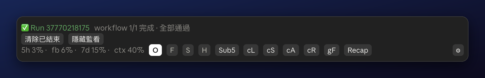
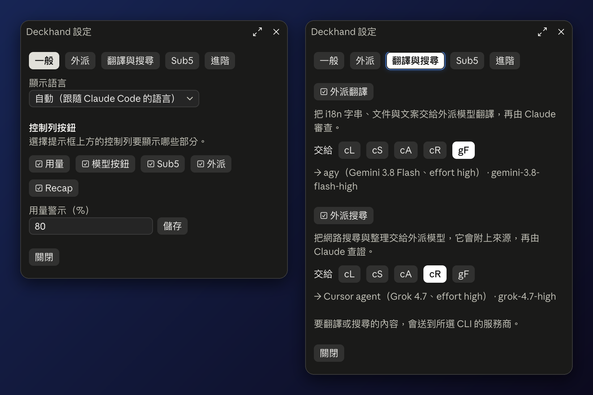

<div align="center">

# Deckhand — Claude Code のマルチ AI ツールバー

**Many hands, one deck.**

使用量メーター、ワンクリックでのモデル切り替え、サブエージェントの並行処理、他の AI CLI からの読み取り専用セカンドオピニオンを、Claude Code の入力欄の上の 1 本のバーにまとめました。

[](plugins/deckhand/.claude-plugin/plugin.json)
[](#前提環境)
[](#インストール)
[](LICENSE)
[](https://github.com/stephen-taipei/deckhand/actions/workflows/ci.yml)

[English](README.md) · [繁體中文](README.zh-TW.md) · [简体中文](README.zh-CN.md) · **日本語** · [한국어](README.ko.md)

</div>

[インストール](#インストール) · [ツールバーの構成](#ツールバーの構成) · [委任ボタン](#委任ボタン) · [設定](#設定) · [その他のツール](#その他のツール) · [プライバシーとセキュリティ](#プライバシーとセキュリティ) · [スポンサー](#スポンサー) · [変更履歴](CHANGELOG.md)



<sub>スクリーンショットは繁体字中国語の表示です。</sub>

[USDT（TRC20）で Deckhand を支援する](#スポンサー)：1 回限りの支援のみ受け付けています。

## Deckhand の概要

Deckhand は Claude Code のプラグインです。ターミナルおよびデスクトップアプリの入力欄の上にツールバーを追加します。Claude をメインエージェントのまま維持しつつ、ツールバーから以下の操作を行えます。

- 各使用量ウィンドウの残り枠を確認する
- 1 クリックでモデルを切り替える
- タスクを分割し、それぞれ別の git worktree でサブエージェントに並行実行させる
- 他の AI CLI に読み取り専用でセカンドオピニオンを求め、Claude にその結果をレビューさせる
- セッションの現状を、平易な言葉で手短に振り返る

## インストール

Claude Code で次の 2 つのコマンドを実行します。

```text
/plugin marketplace add stephen-taipei/deckhand
/plugin install deckhand@deckhand
```

入力欄の上にツールバーが表示されます。表示されない場合は、新しいセッションを開始してください。

## ツールバーの構成

| 項目 | 機能 |
| --- | --- |
| 使用量メーター | 5 時間枠、モデル別の週間枠、全モデル合計の週間枠、コンテキストウィンドウ |
| `O` `F` `S` `H` | モデルを Opus、Fable、Sonnet、Haiku に切り替え |
| `Sub5` | 現在のタスクを最大 5 件に分割し、サブエージェントで並行実行 |
| `cL` `cS` `cA` `cR` `gF` | タスクを他の AI CLI に読み取り専用で委任し、回答を Claude にレビューさせる |
| `Recap` | サイドペインで、現在のコンテキストをたとえ話を交えて平易に解説 |
| `⚙` | 設定ペインを開く（ツールバー右端） |

各ボタンにホバーすると説明が表示されます。

### 使用量メーター

- `5h`: 5 時間枠の使用量。
- お使いのアカウントに適用されているモデル別の週間枠（例: Fable の場合は `fb`）。
- `7d`: 全モデル合計の週間枠。
- `ctx`: コンテキストウィンドウの使用率。

数値は Claude アプリの使用量カードと一致します（端数切り捨て）。各枠が警告しきい値を超えると、Deckhand がトースト通知を 1 回表示します。

### モデルボタン

`O` Opus · `F` Fable · `S` Sonnet · `H` Haiku

- **ターミナル:** ボタンを押すとセッションのモデルが直接切り替わり、設定中の effort も保持されます。
- **デスクトップアプリ:** モデルの管理はアプリ側で行われ、プラグインからはワンクリックで切り替えられません。Claude Code は `/` で始まるプラグインのプロンプトを受け付けず、アプリもセッション自身によるモデル変更を拒否するためです。そこでボタンを押すと入力欄に `/model <name>` が入力されます（入力欄にテキストがある場合は、先に送信するか消去してください）。入力欄で Enter を押すとモデルが切り替わり、アプリのモデルメニューも連動し、Deckhand が effort を元のレベルに戻します。入力欄に入れられない場合（ダイアログが開いているときなど）は、コマンドがクリップボードにコピーされるので、入力欄に貼り付けて Enter を押してください。

### Sub5

Sub5 は、現在のタスクを最大 5 件の独立した作業に分割します。各タスクは個別の git worktree 内で、それぞれ専用のサブエージェントによって同時に実行されます。ワーカーの処理が完了すると、メインエージェントが成果物をレビューして統合し、worktree とブランチをクリーンアップします。

正確な git の手順はスクリプト（`bin/sub5.py`）が実行します。強制処理（force）やリモートへの push は一切行いません。ワーカーのモデル、effort、最大タスク数は設定から変更できます。

run が中断されると（ターンの停止、worker の失敗、セッションの終了）、worktree とブランチが残ることがあります。`/sub5-clean`、または設定の Sub5 タブの「確認」で一覧を表示し、確認後に安全なものだけを削除します：未コミットの変更がない worktree と、マージ済みのブランチです。直近 1 時間以内に使ったものは残します。

### 委任ボタン

委任ボタンを押すと、単一のタスクを他の AI CLI に渡します。委任先の AI は読み取り専用で動作して回答を生成し、Claude がその内容をレビューして妥当な部分を取り込みます。

| ボタン | CLI | モデル | Effort |
| --- | --- | --- | --- |
| `cL` | Codex | GPT-6 Luna | max |
| `cS` | Codex | GPT-6.1 Sol | medium |
| `cA` | Codex | GPT-6 Astra | medium |
| `cR` | Cursor agent | Grok 4.7 | high |
| `gF` | agy | Gemini 3.8 Flash | high |

上記はデフォルト設定です。委任先の設定（ラベル、CLI、モデル ID、effort、表示名、有効/無効）はすべて設定画面で編集できます。

- **CLI ごとの読み取り専用制御:** Codex は `-s read-only`、Cursor agent は `--mode ask` で動作します。agy はヘッドレスモードで起動し、ツールの使用を自動的に拒否します。
- **Web 検索（`search` のみ）:** Codex には `-c web_search="live"`、Cursor agent には `--auto-review`（ask モードのまま）を付け、確認なしで検索できるようにします。agy はヘッドレスモードのままで検索できます。
- **機密情報のチェック:** トークン、キー、パスワードのいずれかを含む依頼内容は送信を拒否します。
- **ローカル履歴:** 依頼内容と回答はプライベートな一時フォルダーに保存され、3 日後に自動削除されます。
- **ツールバーでの進行状況:** 委任の実行中は、使用量の行の上に 1 行追加され、ラベル、CLI、モデル、経過時間を表示します。終了後は結果を 10 分間、または**終了分を消去**を押すまで表示します。停止ボタンはありません。Deckhand は委任を実行する Bash 呼び出しを見ているだけだからです。
- **委任の記録:** `/delegates` を入力するか、終了した行の**記録**を押すと、直近 3 日間の委任を一覧表示します。各回答は全文を開く、コピーする、入力欄が空のときに入力欄に入れる、のいずれかができます。各委任には CLI が数えたトークン数も表示され、上部に CLI ごとの直近 3 日間の合計が出ます。Deckhand は料金を見積もらないため、費用は CLI 自身が報告したときだけ表示されます（Codex、Cursor agent、agy はいずれも現在報告しません）。
- **前提条件:** 対象の CLI がインストールされ、ログイン済みである必要があります。インストールされていない CLI のボタンは非表示になります。

> [!NOTE]
> 委任を行うと、その CLI を提供するサービスプロバイダーに依頼内容が送信されます。

### Recap

Recap は、現在のコンテキスト全体をできる限り簡潔・平易に、たとえ話を交えながらサイドペインで解説します。会話履歴には何も追加されません。ボタンの表記はすべての言語で `Recap` です。

### 設定

ツールバー右端の `⚙`、または `/deckhand` で設定ペインを開けます。ペインは 5 つのタブに分かれています。

| タブ | 設定できる内容 |
| --- | --- |
| 一般 | 表示言語、表示するボタン、使用量の警告しきい値 |
| 委任 | 各委任先のオン／オフ、ラベル、CLI、モデル ID、effort、名前 |
| 翻訳と検索 | 翻訳と Web 検索を委任先に任せるか、どの委任先にするか（`cL`〜`gF`）。どちらも既定はオフです。 |
| Sub5 | worker のモデル、effort、最大項目数、中断した run が残した worktree の数 |
| 詳細設定 | CLI のパスと Codex ホーム、ガード、デプロイ監視、設定ファイル、デフォルトに戻す |



設定はユーザーごとに、このマシンに保存されます。詳細設定タブの「設定ファイル」で、設定を JSON にエクスポート（既定は `~/.deckhand-settings.json`）、変わる項目数を確認してからインポート、またはクリップボードにコピーできます。

### 言語

English、繁體中文、简体中文、日本語、한국어に対応しています。デフォルトの表示言語は Claude Code の `language` 設定に従います。設定ペインから手動で選択することも可能です。

## その他のツール

| ツール | 機能 |
| --- | --- |
| `/watch-deploy` および `watch_deploy` ツール | PR、CI の実行、URL をバックグラウンドで監視します。同じ結果が N 回連続すると自動停止します。 |
| `/handoff`、`/handoff-in`、`/codex` | Claude と Codex の間で作業を引き継ぎます。Codex 向けの引き継ぎメモを作成したり、Codex の最新メモを入力欄に読み込んだり、Codex のインボックスを開いたりできます。 |
| 帰属表示ガード | コミットや PR 作成コマンドから `Co-Authored-By` 行や Claude Code のフッターを削除します。デフォルトはオフです。ただし、Claude の設定で帰属表示をすでにオフにしている場合はオンになります。 |
| ポーリングガード | `sleep` によるポーリングループや `gh run watch` などのブロッキング待機を停止し、同じ結果を N 回連続で返すステータスチェックを中断させます。 |
| `translate` | 設定で選んだ委任先によるローカライズ翻訳。直訳ではなく、現地の開発者が実際に使う自然な言い回しに翻訳します。既定はオフで、`⚙` からオンにできます。 |
| `search` | 設定で選んだ委任先による Web 調査。短い結論、要点、それぞれの出典を返し、Claude が確認します。既定はオフで、`⚙` からオンにできます。 |

## 前提環境

- macOS または Linux。Windows には対応していません（WSL は未検証）。
- プラグインのフックモジュールに対応した Claude Code（2.1.288 で検証済み）。
- Python 3.9 以上。
- 任意: 監視機能を使用する場合は `gh`、委任ボタンを使用する場合は `codex`、Cursor `agent`、`agy` の各 CLI。

## プライバシーとセキュリティ

お使いのマシンの外へ送信されるデータ:

- **委任の依頼内容**: 委任ボタンを押したときにのみ、選択した CLI のプロバイダーへ送信されます。
- **使用量の読み取り**: Claude Code を経由し、セッション自体の認証情報を使用して Anthropic の使用量エンドポイントを呼び出します。
- **ユーザーや Claude が明示的に呼び出したツール**: 対象のサービスと通信します（`translate` と `search` はオンにした場合のみ、選択した委任先へテキストを送信し、監視機能は `gh` 経由で GitHub に問い合わせるか指定された URL を取得します）。

上記以外のデータがマシンの外へ送信されることはありません。

安全性に関するルール:

- 委任処理は、各 CLI 固有のフラグやモードによって読み取り専用が強制されます。
- 機密情報チェックにより、トークン、キー、パスワードを含む依頼内容は拒否されます。
- 依頼内容と回答はプライベートな一時フォルダーに保存され、3 日後に削除されます。
- Sub5 の git スクリプトは、強制処理（force）やリモートへの push を一切行いません。

## 開発

```bash
(cd plugins/deckhand && python3 -m unittest discover -s tests -p 'test_*.py')
python3 -m unittest discover -s scripts -p 'test_*.py'
python3 scripts/scan-secrets.py
```

`scripts/scan-secrets.py` は、Git で追跡されている全ファイルをスキャンし、キー、トークン、URL 内の認証情報、メールアドレス、ホームフォルダーのパスが含まれていないかを検証します。詳細は [CONTRIBUTING.md](CONTRIBUTING.md) をご覧ください。

## スポンサー

1 回限りの USDT による支援は、Deckhand のコード、ドキュメント、5 言語のローカライズの維持に使われます。メンバーシップや、ロードマップ・サポートの優先権は付きません。

**USDT · TRON（TRC20）** · `TGuMUi1d8MoBQcuFrGJZnu4JrbaeP3wy9a`


USDT は TRON（TRC20）ネットワークでのみ送金してください。他のネットワークで送金したトークンは取り戻せません。

## コントリビューション、セキュリティ、ライセンス

[コントリビューション](CONTRIBUTING.md) · [セキュリティポリシー](SECURITY.md) · [変更履歴](CHANGELOG.md) · [ライセンス](LICENSE)

[stephen-taipei](https://github.com/stephen-taipei) が開発・メンテナンスしています。Deckhand は独立したプラグインであり、Anthropic の製品ではありません。[MIT ライセンス](LICENSE)で公開しています。
